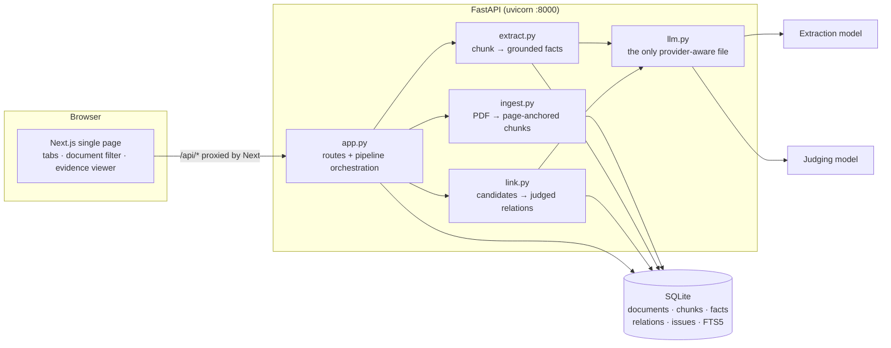
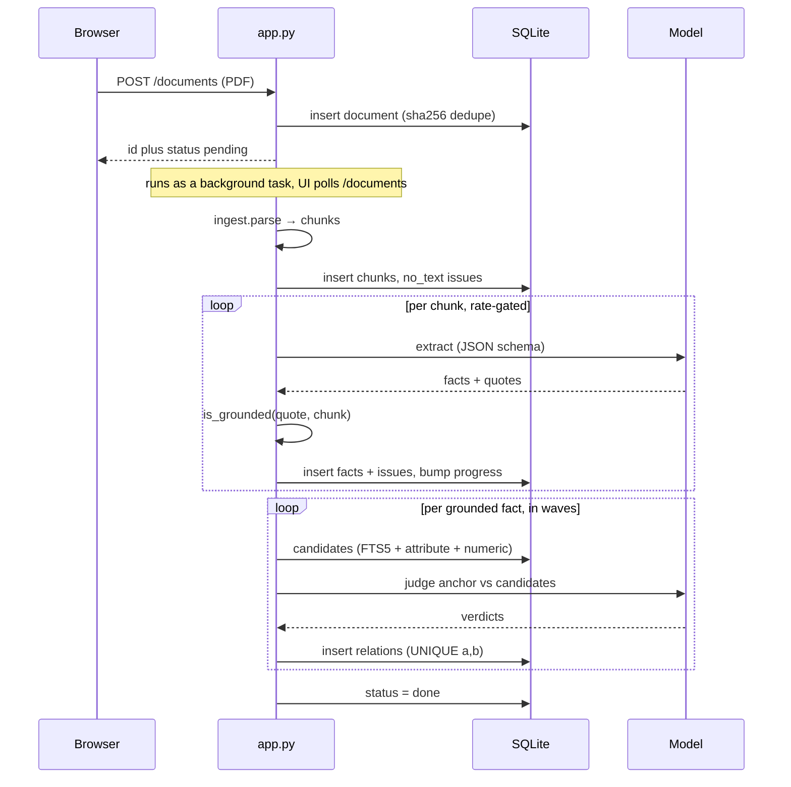
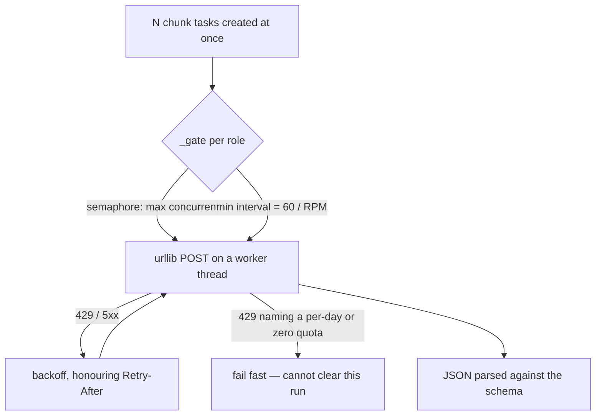

# Architecture

Six Python modules, one SQLite file, one page of UI. No services to run beyond the two
dev servers, and no infrastructure to provision.

---

## System

The browser only ever talks to one origin: `next.config.mjs` rewrites `/api/*` to the
backend, so there is no CORS configuration to get wrong and the backend need not be
exposed.

---

## Module map

| Module | Responsibility | Depends on |
| --- | --- | --- |
| `app.py` | HTTP routes, pipeline orchestration, cancellation, startup reconciliation | everything |
| `ingest.py` | PDF → chunks; the grounding predicate | `pymupdf` |
| `extract.py` | Extraction prompt + schema; magnitude normalisation | `ingest`, `llm` |
| `link.py` | Candidate blocking; judging prompt + schema | `store`, `llm` |
| `llm.py` | One structured-JSON call per role; rate gating; retries | provider HTTP |
| `store.py` | Schema, migrations, all SQL | `sqlite3` |
| `env.py` | Loads `backend/.env` before anything reads `os.environ` | — |

Two support scripts sit alongside: `check_models.py` (preflight — one real call per role)
and `reground.py` (re-run the grounding check over stored facts).

**`llm.py` is the seam.** It is the only file that imports a provider SDK or knows one
exists; `extract.py` and `link.py` import a single function from it. That is what makes
the extraction/judging model split a configuration change rather than a rewrite, and what
made swapping the whole stack from Anthropic to Gemini + Ollama a one-file job.

---

## Pipeline flow

Results are persisted **per unit as they land**, not gathered at the end. That is what
makes progress visible mid-run, lets a cancel keep what already succeeded, and makes a
silent API failure distinguishable from healthy work.

---

## Concurrency and pacing

Every task is created immediately and gated on the way out, so the gate is the single
place that knows a free tier exists. Requests-per-minute is enforced rather than
discovered — without it a run spends its time collecting 429s.

HTTP is stdlib `urllib` on a worker thread rather than an async HTTP dependency. These are
plain JSON POSTs, the gate already bounds concurrency, and it keeps the dependency list to
five packages.

---

## Incremental by construction

Adding a document extracts only its own chunks and judges only its own new facts, against
everything already stored.

- `relations` is `UNIQUE(a_id, b_id)` with the pair normalised to `a < b`, so re-running
  can never duplicate an edge.
- Already-judged pairs are excluded during candidate generation, before any model call.
- Uploading identical bytes is a no-op (SHA-256), unless the previous run produced
  nothing — then it resets and re-runs.

Nothing is ever rebuilt.

---

## Why SQLite, not a graph database

The assignment is explicit that a graph database is not the interesting part, and it is
right: the edges are cheap, the *justification* for each edge is the product.

One SQLite file gives ACID writes, full-text search (FTS5) and numeric range indexes with
zero services to run, and `relations` is a perfectly good edge table. The trade-off is
concurrency — one writer at a time, which is irrelevant for a single-user prototype.

Swapping in Postgres + pgvector is a contained change: `store.py` for the schema and
`link.candidates` for retrieval. Nothing else touches SQL.

---

## Failure handling

Every stage records what it could not do rather than dropping it silently.

| Failure | Recorded as | Effect |
| --- | --- | --- |
| Page with no extractable text | `no_text` issue | Visible blind spot; needs OCR |
| Quote not verbatim in its chunk | `ungrounded_quote` issue, `grounded=0` | Fact quarantined, never forms a relation |
| Model call fails | `llm_error` issue | That chunk is skipped, the run continues |
| Every extraction call fails | document `failed` | Retryable by re-upload |
| Server restarts mid-run | document `interrupted` at startup | No permanently "processing" rows |
| User presses Stop | document `cancelled` | Outstanding calls cancelled, results kept |
