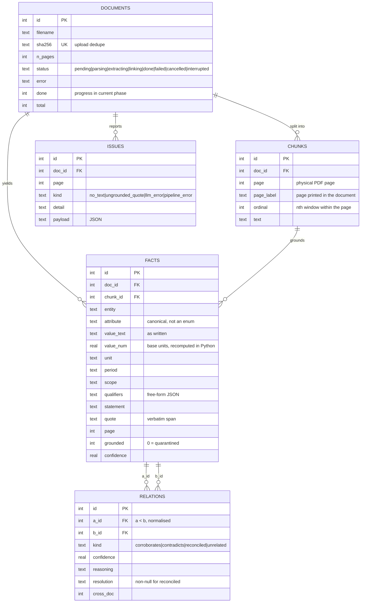
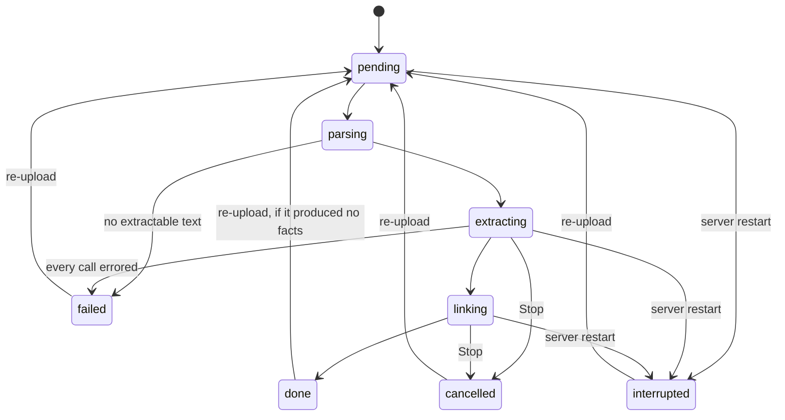

# Data model

One SQLite file, six tables, defined in `store.py`. Integer primary keys throughout so the
FTS5 external-content table can hang off `facts.rowid` directly.

---

## Entity relationships



A seventh object, `facts_fts`, is an FTS5 virtual table over `entity`, `attribute`,
`statement` and `value_text`, kept in sync by insert and delete triggers on `facts`.

---

## What a fact is, and why

```
(entity, attribute, value)  +  the context that decides whether two values may differ
                               ── period, scope, unit ──
```

That second half is the whole design. Two documents reporting different revenue figures
for the same company are not in conflict if one is FY2023 and the other FY2024, or if one
is consolidated and the other standalone. Those dimensions have to be **extracted before
comparison**, as columns rather than prose, or reconciliation is impossible and every
numeric difference looks like a contradiction.

| Column | Role |
| --- | --- |
| `entity` | The subject, written the same way every time it is met |
| `attribute` | Canonical snake_case name for the measure — the join key across documents |
| `value_text` | Exactly as the document expresses it, magnitude words included |
| `value_num` | The same value in base units, **recomputed in Python** from `value_text` |
| `unit` | `INR`, `percent`, `count`, `days`, … — scopes the numeric comparison |
| `period` | Normalised time reference: `FY2024`, `Q4 FY2024`, `as of 2024-03-31` |
| `scope` | The qualification that bounds the claim: consolidated, a segment, provisional |
| `qualifiers` | Free-form JSON for anything else the document's own vocabulary suggests |
| `statement` | Self-contained restatement, used for search and display |
| `quote` | Verbatim span from the chunk — the evidence |
| `grounded` | 0 when the quote failed verification; such facts never form relations |

### The schema evolves without migrations

`attribute` is not an enum and is declared nowhere. It accumulates as documents introduce
new kinds of fact, and `GET /stats` reports the vocabulary as it grows — 40 distinct
attributes appeared from a single 27-page deck. `qualifiers` is free-form JSON, so a new
kind of fact can bring new dimensions (segment, basis, revision status) without a schema
change.

Nothing in the schema mentions any company, document or domain.

---

## Constraints that carry weight

| Constraint | Why it exists |
| --- | --- |
| `documents.sha256 UNIQUE` | Re-uploading identical bytes is a no-op rather than a duplicate |
| `relations UNIQUE(a_id, b_id)` | With `a < b` normalised by the caller, re-running the linker can never duplicate an edge — this is what makes incremental ingest safe |
| `ON DELETE CASCADE` on chunks → facts → relations | Resetting a document for retry drops everything derived from it in one statement |
| `facts_fts` triggers | The search index cannot drift from the table |
| `idx_facts_num`, `idx_facts_attr` | The two non-text candidate signals are index scans, not table scans |

---

## Migrations

`store.init()` runs `CREATE TABLE IF NOT EXISTS`, which will not add columns to a database
created by an earlier version. Columns added later (`done`, `total`) are applied
explicitly with `ALTER TABLE` guarded by a `PRAGMA table_info` check, so an existing
database upgrades in place rather than needing to be deleted.

---

## Lifecycle of a document status



A run exists only inside the process that started it, so anything left in a live status at
startup is reconciled to `interrupted` — otherwise the UI shows a progress bar forever and
Stop has no task to cancel.
