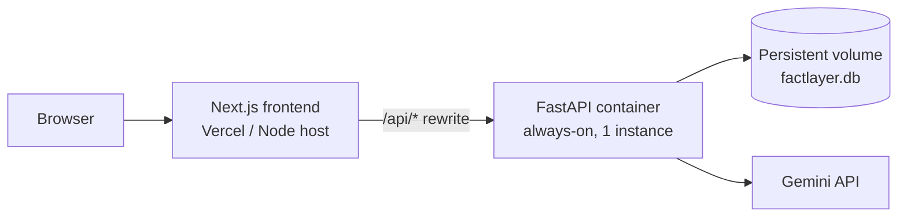

# Deployment

Read this first: **the backend is stateful in two ways that decide every hosting choice.**

1. **SQLite on the local filesystem.** It needs a persistent disk that survives restarts.
2. **Ingestion runs as an in-process background task** and can take many minutes. The
   HTTP request returns immediately; the work continues in the same process.

That rules out serverless (Vercel functions, Lambda, Cloud Run with scale-to-zero) for the
backend — the container is frozen or killed once the response is sent, so the run dies
silently and the document is left `interrupted`. Deploy the backend as a **long-running
container with a persistent volume**. The frontend is a normal Next.js app and can go
anywhere.



---

## Option 1 — Local (what the README describes)

Two terminals, no hosting. This is the right choice for the assignment demo: the reviewer
runs it themselves and nothing depends on a free tier staying up.

---

## Option 2 — Docker, single host

Neither Dockerfile is committed; create them if you need this path.

`backend/Dockerfile`:

```dockerfile
FROM python:3.11-slim
WORKDIR /app
COPY requirements.txt .
RUN pip install --no-cache-dir -r requirements.txt
COPY . .
ENV FACTLAYER_DB=/data/factlayer.db
VOLUME /data
EXPOSE 8000
CMD ["uvicorn", "app:app", "--host", "0.0.0.0", "--port", "8000"]
```

`web/Dockerfile`:

```dockerfile
FROM node:20-alpine
WORKDIR /app
COPY package*.json ./
RUN npm ci
COPY . .
RUN npm run build
EXPOSE 3000
CMD ["npm", "start"]
```

Run them together:

```bash
docker run -d --name nexus-api -v nexus-data:/data -e GEMINI_API_KEY=$GEMINI_API_KEY -p 8000:8000 nexus-api
```

```bash
docker run -d --name nexus-web -e BACKEND_URL=http://nexus-api:8000 -p 3000:3000 nexus-web
```

`BACKEND_URL` is read by `next.config.mjs`, so the rewrite points at the API container
instead of localhost.

---

## Option 3 — Render / Railway / Fly.io + Vercel

**Backend** — a Web Service, not a serverless function:

| Setting | Value |
| --- | --- |
| Build | `pip install -r requirements.txt` |
| Start | `uvicorn app:app --host 0.0.0.0 --port $PORT` |
| Instances | **1** — more than one means separate SQLite files and a split knowledge layer |
| Disk | Mount a volume, then set `FACTLAYER_DB=/data/factlayer.db` |
| Env | `GEMINI_API_KEY`, `FACTLAYER_EXTRACT`, `FACTLAYER_JUDGE`, and the RPM settings |
| Health check | `GET /stats` |

Disable scale-to-zero and any aggressive idle timeout, or long ingests will be killed
mid-run. The startup reconciliation will mark those documents `interrupted` rather than
leaving them stuck, but the work is lost.

**Frontend** — Vercel or any Node host. Set `BACKEND_URL` to the backend's public URL so
the `/api/*` rewrite resolves. Nothing else needs changing; the browser still only talks
to one origin.

---

## Before exposing it publicly

The prototype has no auth and CORS is fully open. At minimum:

- **Add authentication.** Every route is unauthenticated, and `POST /documents` spends
  your API quota. Put it behind a reverse proxy with basic auth, or add a shared-secret
  header check in FastAPI.
- **Narrow CORS.** `allow_origins=["*"]` in `app.py` should become your frontend's origin.
  With the Next rewrite in place you can drop the middleware entirely.
- **Keep `GEMINI_API_KEY` in the platform's secret store**, never in the image or repo.
  `.env` is gitignored; do not add it to a Dockerfile with `COPY`.
- **Cap uploads.** `FACTLAYER_MAX_UPLOAD_MB` defaults to 50.
- **Back up the volume.** The database is the whole knowledge layer; nothing else
  reconstructs it without re-spending API quota.

---

## Scaling notes, honestly

This design is single-node on purpose and the assignment did not ask for more. If it had
to grow:

| Limit | Where it bites | Change |
| --- | --- | --- |
| One writer at a time | Concurrent ingests of different documents | Postgres; `store.py` is the only file with SQL |
| No shared state between instances | Horizontal scaling | Postgres + move the task queue out of process |
| Background task dies with the process | Restarts lose in-flight work | A real queue (RQ, Celery, Cloud Tasks) with the pipeline as a job |
| Brute-force candidate blocking | Large corpora | pgvector as a fourth signal in `link.candidates` |

Each is a contained change, which was the point of keeping the seams where they are.
