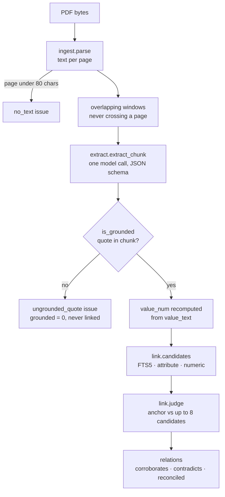
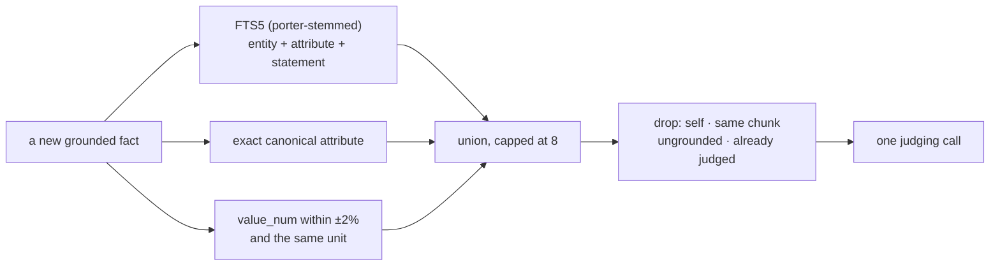

# Pipeline

Four stages: parse, extract, ground, link. Each records what it could not do rather than
dropping it silently.

---

## 1. Ingestion

PyMuPDF extracts text per page. **Chunks never span pages.** That costs a little context at
page boundaries but buys an exact, unambiguous page number for every quote, which is the
entire point of a grounding layer.

Long pages split into overlapping windows (`FACTLAYER_CHUNK_CHARS`, default 4000, overlap
10%) so a sentence cut by a window boundary still appears whole somewhere.

Both the **physical PDF page** and the **printed page label** are stored. The starter
excerpts are curated page ranges whose printed numbers jump, so the two genuinely differ —
and a reviewer checking a citation wants the printed one. Only two of the six starter
documents carry usable labels, which is why the physical number is always kept as the
fallback.

Pages with under 80 characters of extractable text are recorded as `no_text` issues. An
image-only page is a known blind spot, not an absence of facts.

**Measured** — all six starter PDFs, 511 pages, parse in 2.1 s into 653 chunks:

| Document | Pages | Chunks | Image-only |
| --- | ---: | ---: | ---: |
| delhivery prospectus 2022 | 100 | 125 | 1 |
| delhivery annual report FY24 | 100 | 214 | 0 |
| delhivery Q4 FY24 deck | 27 | 23 | 4 |
| economic survey 2024-25 | 89 | 91 | 0 |
| RBI annual report 2024-25 | 100 | 101 | 0 |
| IMF Article IV 2025 | 95 | 99 | 1 |

---

## 2. Extraction

One model call per chunk, constrained by a JSON schema — Ollama's `format`, Gemini's
`responseSchema`, Anthropic's `output_config.format`. The prompt asks for atomic,
checkable facts and explicitly rejects boilerplate, navigation and unfalsifiable claims;
returning an empty list is a correct answer for a table-of-contents page.

The prompt carries a **worked example**, which turned out to matter more than any other
wording change. `period` and `scope` are rarely written inside the sentence being quoted —
they come from a page heading three lines up, or a table column header, or a segment
prefix on the line. Before the example was added, an 8B model returned `period` and
`scope` as null on **every** fact; after, 5/7 and 3/7 on the same page.

### Magnitude is not left to the model

`value_num` is recomputed in Python from `value_text` by `extract.value_num_from_text`:

- `Rs. 127 Cr` → `1.27e9` (crore is 10⁷ — every model tested returned 1.27e8)
- `30%` → `30` (not 0.3)
- `Rs. (452 Cr)` → `-4.52e9` (accounting parentheses are negative)
- `2.5 lakh` → `250000`

It also **refuses digits glued to letters**, because `FY23` and `Q3` were otherwise
parsing as 23 and 3. A spurious number is worse for numeric blocking than no number at
all, so a `value_text` containing only period tokens yields `None`.

This is arithmetic over a string. It does not belong in a prompt.

---

## 3. Grounding

The model must return a span copied character-for-character from the chunk.
`ingest.is_grounded` then checks it against the source text, insensitive to whitespace,
case, curly quotes and dash variants.

A fact whose quote does not survive is stored with `grounded=0`, logged as an
`ungrounded_quote` issue, shown in the UI as a failure, and **never allowed to form a
relation**. An unsupported claim can never be cited as corroboration.

### The bar is ambiguity, not length

The first version required 15 characters. That seemed like a sensible floor until it
rejected **73%** of the facts extracted from the Q4 earnings deck — slide and table
evidence is legitimately short (`YoY: 29.8%`, `7,054`) and was being discarded for brevity
rather than for being wrong.

What makes a short quote weak is that it could point anywhere. So a quote under 15
characters must occur **exactly once** in its chunk to count; a longer one may repeat.

| | before | after |
| --- | ---: | ---: |
| grounded facts | 88 | **233** |
| issues | 312 | **167** |

The 92 that remain ungrounded are genuine paraphrases — a real case-4 population rather
than a broken check.

Because grounding is pure string comparison against chunks that are already stored,
`reground.py` re-runs it over an existing database when the rule changes, instead of
paying for extraction again.

---

## 4. Candidate generation

Three cheap indexed queries in `link.candidates`, no vector store:

Signal 3 is the one that earns its place: it links *"Rs. 722.53 crore"* to *"INR 7.2253
billion"*, where the words share nothing but the magnitudes agree exactly. Because
attributes were canonicalised during extraction, signals 1 and 2 recover most of what an
embedding model would — with no extra service and a query a reviewer can read.

The honest cost: a fact phrased with no shared vocabulary **and** no shared number is
missed at this stage and never reaches the judge. See [Limitations](LIMITATIONS.md).

---

## 5. Judging

**Batched per fact** — one call covering all of a fact's candidates, not one per pair.
That is the difference between hundreds of calls and thousands on a large corpus.

The judge receives both facts in full — source, page, entity, attribute, value (raw and
normalised), period, scope, qualifiers and quote — and returns a label, confidence,
reasoning, and for `reconciled` the specific dimension that explains the gap.

The prompt forces the checking order that matters:

> Never label "contradicts" before checking period, scope, unit and publication date. A
> differing number with a differing period is "reconciled", not a contradiction.

| Label | Meaning |
| --- | --- |
| `corroborates` | Same assertion, both true. Different wording, units or magnitudes of the same number still corroborate. |
| `contradicts` | Same entity, measure, period **and** scope, and cannot both be true, with no reconciling context available. |
| `reconciled` | Looks contradictory but both are plausibly true once a stated difference is taken into account. `resolution` must name it. |
| `unrelated` | Everything else — the correct and expected answer for most pairs. |

Facts are judged in waves of 32 rather than one batch, so facts stored by one wave are
candidates for the next and a document's internal contradictions surface in a single pass.
